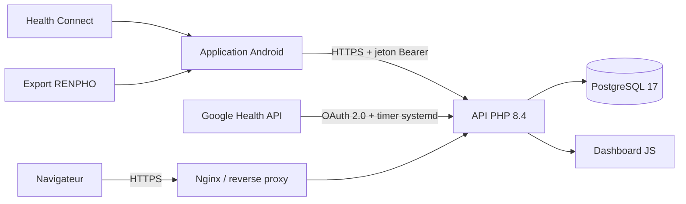

# Pizid Motion — Health Connect personnel

Plateforme auto-hébergée pour sauvegarder, consolider et visualiser les données
de santé d'un téléphone Android. Le projet associe une application Android,
une API PHP, PostgreSQL et un tableau de bord Web orienté santé et activités
sportives avec traces GPS.

> Ce projet manipule des données de santé et de localisation très sensibles.
> Le dépôt ne contient ni export utilisateur, ni jeton, ni mot de passe. Une
> instance publique doit obligatoirement être protégée par authentification.

## Fonctionnalités

- synchronisation incrémentale de plus de 100 types Health Connect ;
- reprise idempotente après interruption réseau ;
- synchronisation Android horaire et mode prioritaire discret ;
- import manuel borné des cinq dernières sessions pour récupérer les routes GPS ;
- partage direct d'un export RENPHO vers l'application Android ;
- import Google Health pour les mesures qui ne remontent pas dans Health Connect ;
- tableau de bord santé : poids, composition corporelle, sommeil, SpO₂,
  fréquence cardiaque, activité et tendances ;
- analyse des sorties : itinéraire, allure lissée, cadence, fréquence
  cardiaque, zones, kilomètres intermédiaires, records et parcours similaires ;
- API JSON documentée avec OpenAPI.

## Architecture



L'installation de référence utilise un conteneur Debian sous Proxmox, mais le
serveur fonctionne sur toute machine Linux disposant de Nginx, PHP-FPM et
PostgreSQL.

## Arborescence

| Chemin | Rôle |
|---|---|
| `android/` | application Android native et synchronisation Health Connect |
| `public/` | point d'entrée HTTP, dashboard et ressources statiques |
| `src/` | contrôleurs PHP, authentification et analyses |
| `infra/sql/` | schémas PostgreSQL et migrations |
| `infra/nginx/` | exemple de virtual host Nginx |
| `infra/systemd/` | synchronisation périodique Google Health |
| `infra/import/` | import historique Health Connect et RENPHO |
| `docs/openapi.yaml` | contrat de l'API JSON |
| `tests/fixtures/` | charges utiles de test sans données personnelles |

## Démarrage rapide

1. Préparer un serveur Debian avec PostgreSQL, Nginx et PHP-FPM.
2. Créer la base et appliquer les migrations SQL.
3. Copier `.env.example` vers `/etc/health-connect/app.env`, puis renseigner les
   secrets uniquement sur le serveur.
4. Déployer le projet dans `/var/www/health-connect` et activer la configuration
   Nginx.
5. Adapter l'URL d'API Android, compiler l'APK et provisionner son jeton.
6. Ouvrir `/dashboard` et vérifier `/api/v1/health`.

Les commandes complètes figurent dans [le guide d'installation](docs/INSTALLATION.md).

## Documentation

- [Architecture et flux de données](docs/ARCHITECTURE.md)
- [Installation du serveur](docs/INSTALLATION.md)
- [Application Android et synchronisation](docs/ANDROID.md)
- [Exploitation, sauvegarde et diagnostic](docs/OPERATIONS.md)
- [Sécurité et confidentialité](docs/SECURITY.md)
- [Contrat OpenAPI](docs/openapi.yaml)

## API

Les routes de synchronisation Android utilisent un jeton Bearer. Les routes du
dashboard suivent l'authentification Web de l'instance.

| Route | Description |
|---|---|
| `GET /api/v1/health` | disponibilité du service |
| `GET /api/v1/sync/status` | état du terminal authentifié |
| `POST /api/v1/sync/batches` | envoi transactionnel et idempotent |
| `POST /api/v1/sync/renpho` | import d'un export RENPHO partagé |
| `GET /api/v1/dashboard/health` | indicateurs de santé agrégés |
| `GET /api/v1/dashboard/activities` | activités possédant une route GPS |
| `GET /api/v1/dashboard/activities/{id}` | analyse complète d'une sortie |
| `GET /api/v1/dashboard/activities/{id}/cadence` | série de cadence allégée |

La description exhaustive est servie par `/api/v1/openapi.yaml`.

## Principes de données

- Chaque enregistrement conserve son `payload` JSONB complet.
- Les champs fréquents sont normalisés pour les analyses et les index.
- `(record_type, record_key)` garantit les upserts idempotents.
- Les suppressions Health Connect sont propagées.
- Les routes GPS suivent un flux d'autorisation Android distinct.
- Le dashboard sportif n'agrège que les activités Health Connect disposant
  effectivement d'une trace GPS.

## Limites

- Ce tableau de bord n'est pas un dispositif médical et ne fournit aucun
  diagnostic.
- Certaines données calculées par Fitbit ou Google Health ne sont pas exposées
  par Health Connect.
- L'import historique `003_import_snapshot_20260912.sql` correspond à la
  première instance et sert d'exemple de migration, pas de migration générique.
- Les cartes utilisent un fournisseur de tuiles tiers : respecter ses
  conditions d'utilisation et sa politique de confidentialité.

## Développement et validation

```bash
# PHP
find src public bin infra -name '*.php' -print0 | xargs -0 -n1 php -l

# Android
cd android
export JAVA_HOME=/path/to/jdk-17
./gradlew :app:assembleDebug
```

Avant tout déploiement, relire [la liste de contrôle de sécurité](docs/SECURITY.md).
