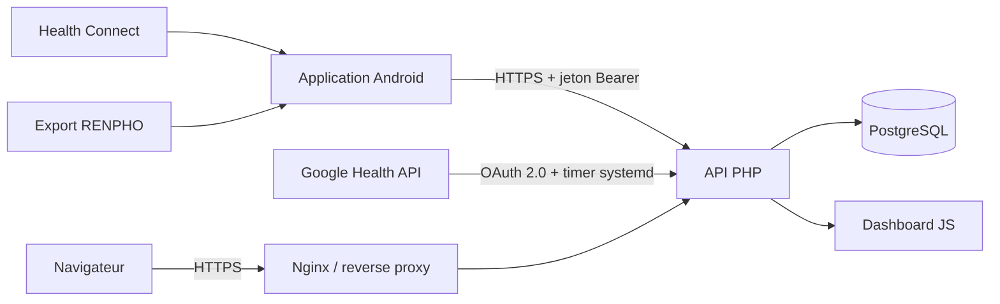

# Pizid Motion — Health Connect auto-hébergé

Pizid Motion est une plateforme auto-hébergée pour sauvegarder, consolider et
visualiser des données de santé provenant d'un téléphone Android. Le projet
associe une application Android, une API PHP, PostgreSQL et un tableau de bord
Web orienté santé et activités sportives avec traces GPS.

> Ce projet manipule des données de santé et de localisation très sensibles.
> Le dépôt ne contient aucun export utilisateur, jeton, mot de passe ou donnée
> de production. Toute instance exposée sur un réseau non fiable doit être
> protégée par HTTPS et authentification.

## Fonctionnalités

- synchronisation incrémentale de plus de 100 types Health Connect ;
- reprise idempotente après interruption réseau ;
- synchronisation Android horaire et mode prioritaire discret ;
- import manuel borné des dernières sessions pour récupérer les routes GPS ;
- partage direct d'un export RENPHO vers l'application Android ;
- import Google Health pour les mesures non exposées par Health Connect ;
- tableau de bord santé : poids, composition corporelle, sommeil, SpO₂,
  fréquence cardiaque, activité et tendances ;
- analyse des sorties : itinéraire, allure lissée, cadence, fréquence
  cardiaque, zones, kilomètres intermédiaires, records et parcours similaires ;
- API JSON documentée avec OpenAPI.

## Architecture



L'installation de référence utilise Linux, Nginx, PHP-FPM et PostgreSQL. Le
projet n'est pas lié à un hyperviseur, un nom de domaine ou une instance
particulière.

## Arborescence

| Chemin | Rôle |
|---|---|
| `android/` | application Android native et synchronisation Health Connect |
| `public/` | point d'entrée HTTP, dashboard et ressources statiques |
| `src/` | contrôleurs PHP, authentification et analyses |
| `infra/sql/` | schémas PostgreSQL et migrations |
| `infra/nginx/` | exemples de configuration Nginx |
| `infra/systemd/` | synchronisation périodique Google Health |
| `infra/import/` | outils d'import RENPHO |
| `docs/openapi.yaml` | contrat de l'API JSON |
| `tests/fixtures/` | charges utiles synthétiques de test |

## Démarrage rapide

1. Prépare un serveur Linux avec PostgreSQL, Nginx et PHP-FPM.
2. Crée la base et applique les migrations SQL documentées dans
   [INSTALLATION.md](docs/INSTALLATION.md).
3. Copie `.env.example` vers `/etc/health-connect/app.env`, puis renseigne les
   secrets uniquement sur le serveur.
4. Déploie le projet dans `/var/www/health-connect` et active la configuration
   Nginx.
5. Compile l'application Android en fournissant ton URL d'API avec
   `PIZID_API_BASE_URL`.
6. Provisionne un jeton par terminal.
7. Ouvre `/dashboard` et vérifie `/api/v1/health`.

Les commandes complètes figurent dans [le guide d'installation](docs/INSTALLATION.md).

## Configuration Android

L'URL d'API n'est pas codée en dur dans le projet. Exemple :

```bash
cd android
export PIZID_API_BASE_URL=https://health.example.org/api/v1
./gradlew :app:assembleDebug
```

Voir [ANDROID.md](docs/ANDROID.md) pour le provisionnement du jeton et les
permissions Health Connect.

## API

Les routes de synchronisation Android utilisent un jeton Bearer propre à chaque
terminal. Les routes du dashboard utilisent une authentification Web séparée.

| Route | Description |
|---|---|
| `GET /api/v1/health` | disponibilité du service |
| `GET /api/v1/sync/status` | état du terminal authentifié |
| `POST /api/v1/sync/batches` | envoi transactionnel et idempotent |
| `POST /api/v1/sync/renpho` | import d'un export RENPHO partagé |
| `GET /api/v1/dashboard/health` | indicateurs de santé agrégés |
| `GET /api/v1/dashboard/activities` | activités possédant une route GPS |
| `GET /api/v1/dashboard/activities/{id}` | analyse complète d'une sortie |
| `GET /api/v1/dashboard/activities/{id}/cadence` | série de cadence allégée |

La description exhaustive est disponible dans [docs/openapi.yaml](docs/openapi.yaml).

## Sécurité et confidentialité

Avant tout déploiement, lis [docs/SECURITY.md](docs/SECURITY.md).

En particulier :

- aucun export de santé, dump, GPX/TCX, fichier OAuth ou secret ne doit être
  committé ;
- PostgreSQL ne doit pas être exposé directement à Internet ;
- l'instance doit utiliser HTTPS ;
- le dashboard doit être protégé avec `WEB_PASSWORD_HASH_B64` ;
- chaque terminal doit disposer de son propre jeton ;
- les sauvegardes doivent être protégées au même niveau que les données
  d'origine.

## Développement et validation

PHP :

```bash
find src public bin infra -name '*.php' -print0 | xargs -0 -n1 php -l
```

Android :

```bash
cd android
export JAVA_HOME=/path/to/jdk-17
export PIZID_API_BASE_URL=https://health.example.org/api/v1
./gradlew :app:assembleDebug
```

## Contribuer

Les contributions sont bienvenues. Consulte [CONTRIBUTING.md](CONTRIBUTING.md)
avant de proposer une modification, notamment pour les règles concernant les
données de santé et les secrets.

## Licence

Pizid Motion est distribué sous licence MIT. Voir [LICENSE](LICENSE).

## Avertissement

Pizid Motion n'est pas un dispositif médical. Les graphiques, tendances,
agrégations et estimations produits par le logiciel sont fournis uniquement à
titre informatif.
