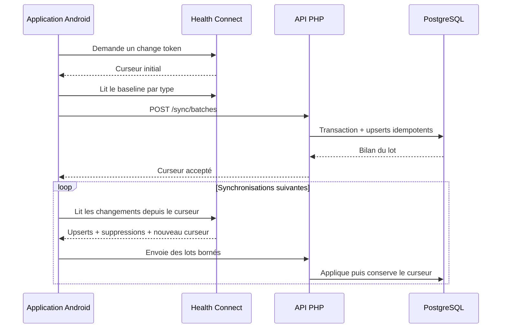

# Architecture et flux de données

## Composants

### Application Android

L'application lit les enregistrements autorisés via l'API native Health
Connect. Elle conserve localement les jetons de changement et le jeton API,
chiffré avec Android Keystore. Elle n'a aucun droit d'écriture dans Health
Connect.

Deux planificateurs coexistent :

- **WorkManager** fournit une synchronisation périodique opportuniste lorsque
  le réseau est disponible ;
- **AlarmManager + foreground service** fournit le mode prioritaire horaire,
  accompagné d'une notification silencieuse uniquement pendant l'envoi.

Les routes GPS sont particulières : Android peut demander un consentement par
activité. Leur import manuel est donc séparé de la synchronisation ordinaire.

### API PHP

`public/index.php` est le routeur HTTP. Les contrôleurs sont séparés par
responsabilité :

- `SyncController` : lots Android, curseurs et suppressions ;
- `RenphoController` : exports de composition corporelle ;
- `GoogleHealthController` : OAuth et SpO₂ Google Health ;
- `AnalyticsController` : indicateurs, activités et comparaisons ;
- `WebAuth` : session du dashboard.

Chaque réponse JSON dynamique utilise `Cache-Control: no-store`. Les erreurs
internes sont journalisées côté serveur et ne révèlent pas les détails au client.

### PostgreSQL

La base est organisée en trois schémas :

- `ingestion` : catalogue des snapshots historiques ;
- `health` : sources, types, enregistrements, échantillons et mesures RENPHO ;
- `api` : terminaux, lots, curseurs, suppressions et jetons OAuth chiffrés.

`health.records` stocke l'enveloppe normalisée et le payload JSONB complet.
`health.samples` contient les séries temporelles : rythme cardiaque, cadence,
phases de sommeil et points GPS.

## Synchronisation incrémentale

Le serveur identifie un lot avec `batch_id` et son SHA-256. Une reprise avec le
même contenu est sans effet secondaire ; une réutilisation avec un contenu
différent est refusée.

## Analyse sportive

Une activité n'est affichée que si une route GPS valide est reliée à sa session
Health Connect. La distance de route est prioritaire, puis la distance mesurée
par la même application source. Cela évite les doublons issus de services tiers.

Le détail d'activité produit :

- une allure lissée spatialement ;
- les zones et la courbe de fréquence cardiaque ;
- la cadence filtrée et décimée ;
- les kilomètres intermédiaires ;
- la comparaison avec des routes de distance et de forme proches.

## Frontières de confiance

- Le reverse proxy termine TLS et transmet l'en-tête `Authorization`.
- L'API de synchronisation exige un jeton par terminal.
- Le dashboard utilise une session Web distincte.
- PostgreSQL n'est jamais exposé directement à Internet.
- Les exports, sauvegardes et fichiers OAuth restent hors du dépôt.
